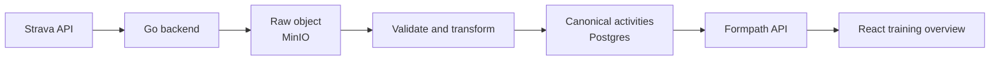

# Formpath

**An open, local-first health and performance platform that turns fragmented
training data into useful context for real-world athletic goals.**

Athletes often have workouts, recovery signals, and plans spread across
different apps and devices. Formpath explores a more coherent alternative:
preserve the original data, normalize it into a provider-neutral model, and
build trustworthy insights and adaptive experiences on top.

The current product connects to Strava, imports activities through a raw-first
ELT pipeline, and presents recent training volume in an accessible React
dashboard. The longer-term direction is a cross-platform foundation for goals,
recovery, and agent-assisted training decisions.

Formpath is a portfolio project built to demonstrate end-to-end product
engineering: product discovery, architecture decisions, backend and frontend
development, data modeling, testing, and durable technical documentation.

## Features

- Strava OAuth2 connection with CSRF state validation and automatic token
  refresh
- Request-driven activity synchronization with explicit rate-limit handling
- Raw provider responses stored unchanged in MinIO before transformation
- Checksum verification when raw objects are loaded for transformation
- Provider-neutral canonical activities persisted in Postgres
- Deduplicated activity updates by provider identity
- A responsive four-week training overview built from real imported data
- Summary metrics for activity count, distance, moving time, and elevation
- Daily cross-sport moving-time, running-distance, cycling-distance, and
  workout-time charts
- Exact chart values available through pointer, touch, and keyboard interaction
- Clear connected, disconnected, loading, empty, syncing, and error states
- Infrastructure-free default test suites, with opt-in Postgres, MinIO, and
  real-provider tests

The current product slice under design adds a dated running or cycling goal and
factual training context around it. See the
[roadmap](docs/product/roadmap.md) and
[Epic 004](docs/epics/004-goal-aware-training-status.md) for the boundary
between implemented and planned behavior.

## Architecture

Formpath treats imported provider data as valuable source material rather than
disposable API responses.



The ingestion flow is deliberately **raw-first**:

1. Extract a successful provider response as opaque bytes.
2. Store those bytes unchanged and record their metadata.
3. Read the persisted object back and verify its checksum.
4. Transform it into the canonical Formpath model.
5. Persist queryable records in Postgres.

This preserves the original source for debugging and future reprocessing while
keeping product features independent of Strava-specific response shapes.

The architecture remains intentionally local-first. Postgres maps naturally to
a future managed relational database, and MinIO provides the same S3-shaped
storage contract that can later move to object storage in the cloud.

## Engineering Highlights

- **Thin composition root:** startup, persistence wiring, and route
  registration stay separate from provider and storage behavior.
- **Provider boundary:** Strava DTOs are transformed into a canonical activity
  model before product calculations consume them.
- **Secure integration behavior:** app credentials stay in environment
  variables, tokens remain server-side, and sensitive values are not returned
  in API errors.
- **Recoverable ingestion:** canonical transformation only uses persisted raw
  data; failed transformations do not discard successfully extracted payloads.
- **Accessible visualization:** custom responsive SVG charts expose equivalent
  values and interactions to mouse, touch, and keyboard users.
- **Testable calculations:** formatting, aggregation, chart geometry, and
  interaction logic live outside React rendering.
- **Documented decisions:** epics define scope, ADRs explain durable
  architecture choices, and changelogs record what was actually delivered and
  verified.

## Technology

| Area | Technology |
|---|---|
| Backend | Go, `net/http` |
| Frontend | React, TypeScript, Vite |
| Database | PostgreSQL |
| Raw object storage | MinIO with an S3-compatible API |
| Provider integration | Strava OAuth2 and REST API |
| Visualization | Custom SVG with `d3-shape` |
| Backend tests | Go testing package and `httptest` |
| Frontend tests | Vitest |
| Local runtime | Docker Compose |

## Local Development

### Prerequisites

- A container runtime with Docker Compose, such as Docker Desktop, OrbStack, or
  Colima
- Node.js 24, as selected by [`.nvmrc`](.nvmrc)
- A Strava API application for the OAuth flow

Configure the Strava application callback URL as:

```text
http://localhost:8080/auth/strava/callback
```

### Start the backend and storage

Create a local environment file and add the Strava client credentials:

```sh
cp .env.example .env
```

Start the Go backend, Postgres, and MinIO:

```sh
docker compose up --build
```

### Start the frontend

In a second terminal:

```sh
cd web
npm ci
npm run dev
```

Open [http://localhost:5173](http://localhost:5173).

| Service | Address |
|---|---|
| React application | [http://localhost:5173](http://localhost:5173) |
| Go backend | [http://localhost:8080](http://localhost:8080) |
| Postgres | `localhost:5432` |
| MinIO API | [http://localhost:9000](http://localhost:9000) |
| MinIO console | [http://localhost:9001](http://localhost:9001) |

The Vite development server proxies `/api` and `/auth` requests to the Go
backend. When the backend runs directly with `go run ./cmd/server`, the
localhost values in [`.env.example`](.env.example) have the expected shape.

When `DATABASE_URL` is configured, complete S3-compatible storage configuration
is required. The backend checks this dependency during startup because
canonical transformation only runs against persisted raw objects.

## Verification

Run the infrastructure-free backend suite:

```sh
go test ./...
```

Run the frontend tests and quality checks:

```sh
cd web
npm test
npm run lint
npm run build
```

Postgres and MinIO integration tests are opt-in. Read
[`cmd/server/storage_integration_test.go`](cmd/server/storage_integration_test.go)
before enabling them. The real Strava smoke test is also opt-in and documented
in
[`cmd/server/strava_athlete_smoke_test.go`](cmd/server/strava_athlete_smoke_test.go).

## Project Structure

```text
cmd/server/       Go backend, provider integration, persistence, and tests
migrations/       PostgreSQL schema migrations
web/              React and TypeScript application
docs/product/     Product vision and roadmap
docs/epics/       Feature scope and acceptance criteria
docs/adr/         Accepted architectural decisions
docs/changelog/   Delivered behavior and verification history
```

## Product Direction

Formpath is moving from a useful training overview toward goal-aware and,
eventually, recovery-aware support:

1. Add dated running and cycling goals with factual training context.
2. Introduce deeper workout analysis.
3. Add recovery signals such as sleep, HRV, and resting heart rate.
4. Build explainable recovery states based on personal baselines and training
   load.
5. Support adaptive recommendations and agent-assisted training experiences.

Future capabilities are intentionally kept separate from current claims. The
[product vision](docs/product/vision.md) describes the long-term purpose, while
the [roadmap](docs/product/roadmap.md) identifies current and candidate work.

## Documentation

- [Product vision](docs/product/vision.md)
- [Product roadmap](docs/product/roadmap.md)
- [Epics](docs/epics/)
- [Architecture decisions](docs/adr/)
- [Changelog](docs/changelog/)

Epics describe intended scope. Changelog entries describe what was actually
implemented and verified. Their independent numbering is linked through
frontmatter so project history remains explicit without forcing a one-to-one
relationship.
